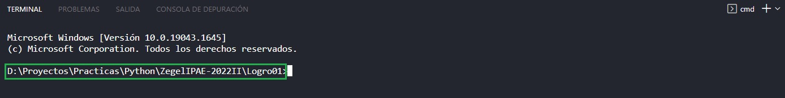
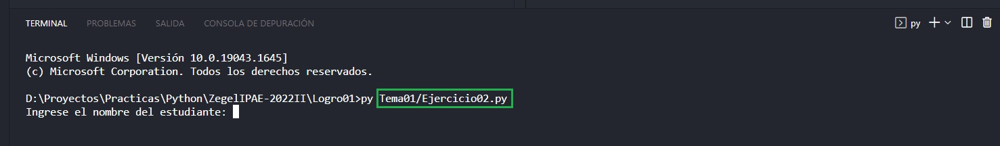

# Consideraciones
Para estos ejercicios se recomienda tener configurado correctamente las siguientes herramientas:
- Visual Code
- Python3+

Antes de ejecutar el programa desde la terminal de windows, o la terminal que ofrece Visual Code. Verifique la ruta donde se encuentra ubicado.

Caso contrario tendrá que acceder a la ruta donde se encuentra el archivo .PY

Para ejecutar los ejercicios se debe escribir el siguiente comando:  
`py Ejercicio01.py`
